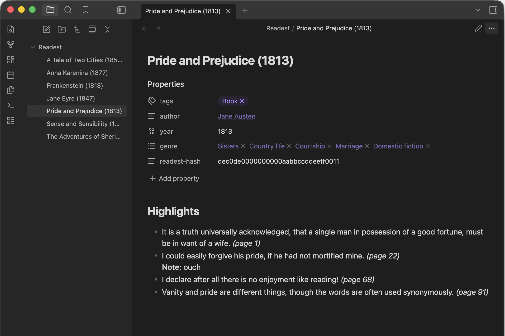

# Obsidian Readest Highlights

[Readest](https://readest.com) stores its library, progress, and annotations locally as JSON. This plugin reads those files and renders the highlights into your Obsidian vault.

**Docs:** [Install](https://github.com/polybjorn/obsidian-readest-highlights/blob/main/docs/install.md), [Settings reference](https://github.com/polybjorn/obsidian-readest-highlights/blob/main/docs/settings.md)

## Requirements

Desktop Obsidian with access to a Readest Books folder. Readest's built-in sync (optional) is the easiest way to collect annotations from other devices into one folder, but any setup that exposes the folder to Obsidian works.

## What the plugin accesses

- **Readest folder, read-only.** A path outside your vault, configured in Settings. The plugin only reads `library.json` and each book's `config.json`, and never writes to this folder. Reading outside the vault requires the Node `fs` module because Obsidian's vault API does not cover external paths.
- **Vault, read and write.** Scans notes for the `readest-hash` frontmatter field inside your output folder to match books to existing notes on re-sync, then creates or updates notes there.
- **No network.** The plugin makes no outbound requests.

## Commands

| Command | Action |
|---|---|
| Sync all books to folder | Creates or updates a note per book in the configured folder. |
| Sync one book to folder... | Pick a single book from a fuzzy picker. |
| Append one book to current note... | Pick a book, appends its highlights to the active note. |

## Disclaimer

Independent community plugin, not affiliated with Readest.
