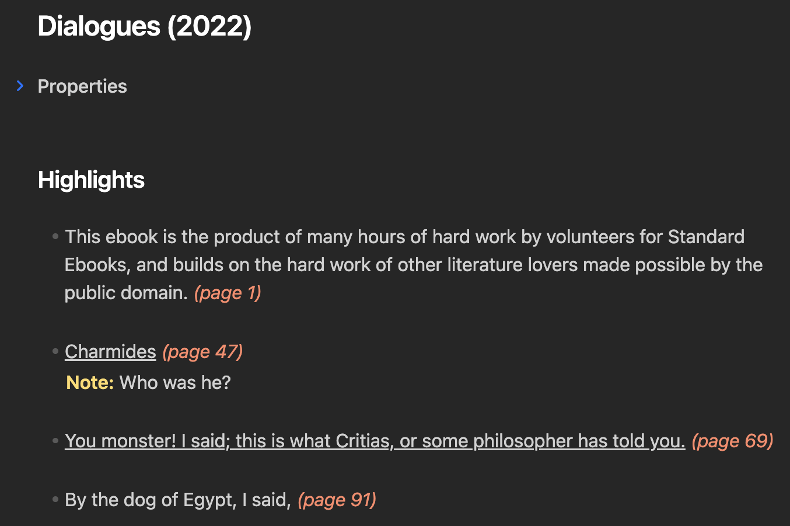
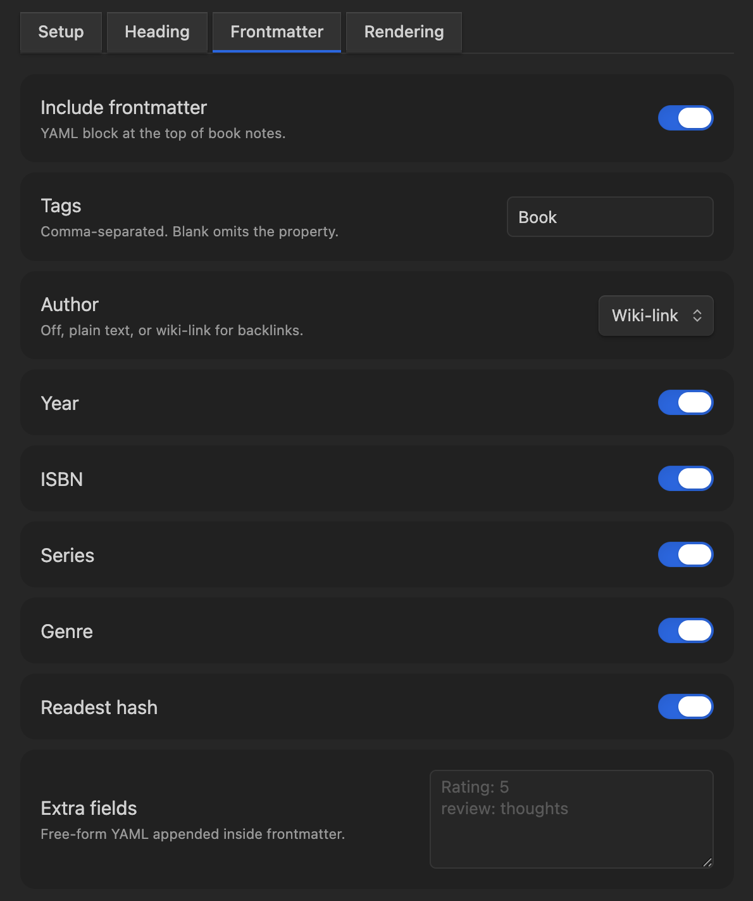

# Obsidian Readest Highlights

Import highlights and annotations from [Readest](https://readest.com) into your Obsidian vault.

Readest stores its library, progress, and annotations locally as JSON. This plugin reads those files and renders the highlights into markdown notes, either as one note per book in a dedicated folder, or appended to whichever note you have open.

Works offline: no API tokens, no external services. The plugin reads Readest's JSON directly.

## Requirements

Desktop Obsidian with access to a Readest Books folder. Readest's built-in sync (optional) is the easiest way to collect annotations from other devices into one folder, but any setup that exposes the folder to Obsidian works.

The plugin reads this folder from outside your Obsidian vault. Access is read-only; the plugin never modifies Readest's files or sends any data over the network.

## Commands

| Command | Action |
|---|---|
| Sync all books to folder | Creates or updates a note per book in the configured folder. |
| Sync one book to folder... | Pick a single book from a fuzzy picker. |
| Append one book to current note... | Pick a book, appends its highlights to the active note. |

## Settings

Settings are split into four tabs.

### Setup

- **Source**: one or more paths to Readest's Books folder. The first valid path is used, so you can list per-device locations for vaults synced across devices.
- **Output**: vault folder and filename template. Templates accept tokens `{title}`, `{author}`, `{year}`, `{series}`, `{seriesIndex}`, `{isbn}`, `{hash}`.

### Heading

- **Heading level**: H1-H4 or None. Applied to both sync and append.
- **Sync heading / Append heading**: heading text (token-aware) shown above highlights in each mode.
- **Preserve manual edits**: on re-sync, only rewrite the highlights section; other content stays. Disabled when heading level is None.

### Frontmatter

Optional YAML block at the top of book notes. Pick which fields to include (tags, author as plain text or wiki-link, year, ISBN, series, genre, Readest hash) and/or add free-form YAML.

### Rendering

- **Highlights**: filter (all / only highlights / only underlines / only with notes / marked), style (blockquote, plain, callout, bullet), and separator (horizontal rule, blank line, page heading, none).
- **Metadata**: page number and color toggles, inline or below-highlight placement. Underlined annotations render as `<u>…</u>` so they stay visually distinct (toggleable).
- **Notes**: include personal notes attached to highlights, placed inside the highlight, separated below, or in a `> [!note]` callout.

## Re-sync behavior

On re-sync the plugin looks for an existing note with a matching `readest-hash` in its frontmatter before falling back to the filename template. Renaming a note in Obsidian or changing the filename template doesn't orphan old notes, as long as the Readest hash frontmatter field is kept on.

## Disclaimer

Independent community plugin, not affiliated with Readest. Development was AI-assisted.
