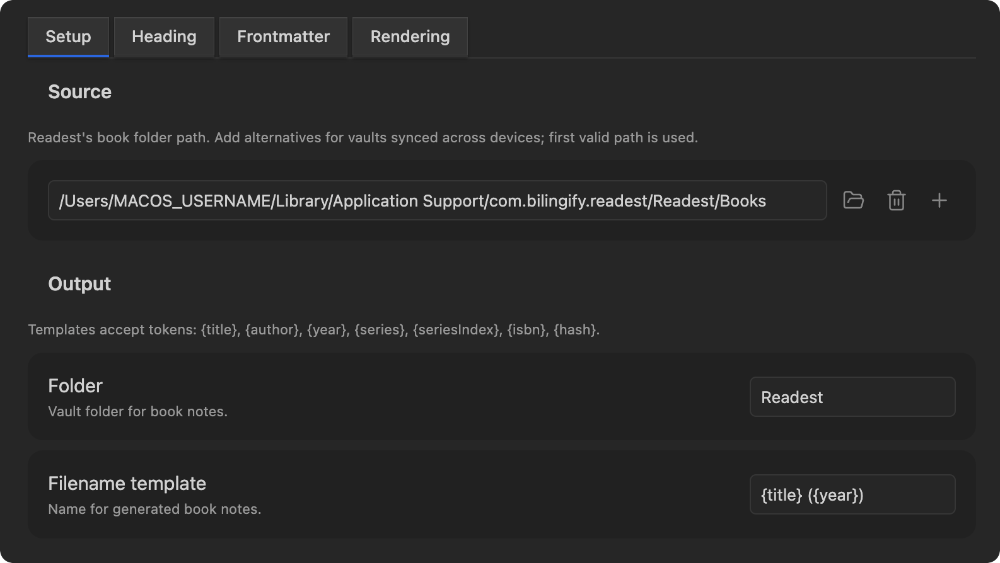

# Settings reference

The settings UI has four tabs: Setup, Heading, Frontmatter, and Rendering.

## Templates

Several settings accept token-based templates. Available tokens:

| Token | Value |
|---|---|
| `{title}` | Book title |
| `{author}` | Author name |
| `{year}` | Publication year (`YYYY` extracted from metadata) |
| `{series}` | Series name |
| `{seriesIndex}` | Index within the series |
| `{isbn}` | ISBN |
| `{hash}` | Readest's internal book hash |

Empty tokens collapse cleanly: surrounding whitespace, separators (`-`, `_`), a trailing `by`, and empty parentheses/brackets are trimmed.

## Setup



### Source

One or more paths to Readest's Books folder. The plugin tries each in order and uses the first one that contains `library.json`. If none of your listed paths match (or if the list is empty), the platform default is tried as a fallback. When the fallback succeeds and you had at least one explicit entry, the discovered path is appended to your list so the next sync skips the lookup. Useful for vaults synced across devices where the same Readest data lives at different absolute paths.

Default location per platform:

| Platform | Default location |
|---|---|
| macOS | `~/Library/Application Support/com.bilingify.readest/Readest/Books` |
| Windows | `%APPDATA%\com.bilingify.readest\Readest\Books` |
| Linux | `$XDG_DATA_HOME/com.bilingify.readest/Readest/Books` (or `~/.local/share/...`) |

The folder icon opens a directory picker. You can also type the path manually.

### Output

#### Folder

Vault folder where book notes live. Defaults to `Readest`. If cleared, falls back to the default. The path is kept vault-relative: leading slashes and `.`/`..` segments are stripped (so it can't escape the vault), and you're notified if the value was adjusted. If the path resolves to an existing file (not a folder), sync fails with a clear error.

#### Filename template

Token-aware. Default `{title} ({year})`. The result is sanitized (Windows-reserved characters stripped) and capped at 200 characters to stay under common filesystem limits.

If two books produce the same filename, the second is written to `<filename> (<hash8>).md` instead of overwriting the first.

## Heading

### Heading level

`H1`-`H4`, or `None`. Applies to both the sync flow and the append flow. `None` removes the heading entirely; in that mode "Preserve manual edits" is force-disabled (sync rewrites the whole body).

### Sync heading

Token-aware heading text shown above the highlights section in notes created or updated by sync. Default `Highlights`.

### Append heading

Token-aware heading text used by the "Append one book to current note..." command. Default `{title} by {author}`.

### Preserve manual edits

When on (default), re-sync rewrites only the section under the sync heading. Frontmatter and any other content outside that section are preserved across syncs. When off, sync rewrites the entire file including frontmatter.

Force-disabled when Heading level is `None`.

## Frontmatter

Optional YAML block at the top of book notes.

### Include frontmatter

Master toggle. When off, all frontmatter options below are hidden.

### Tags

Comma-separated list of tags. Each is quoted in YAML, so values with `:` or `,` do not break the block. Leave blank to omit the property.

### Author

Off, plain text, or wiki-link. The wiki-link form renders as `author: "[[Author Name]]"` for backlink navigation in Obsidian.

### Year, ISBN, Series

Single toggles. Each adds the corresponding field to frontmatter when its value is present in the book's metadata.

### Genre

Master toggle for the genre field. Genres come from the book's metadata as exposed by Readest. The field is free-form and varies by source, so the four sub-options below normalize the more structured forms.

#### Format

`Plain` or `Wiki-link`. Same idea as Author. Defaults to `Plain`.

Wiki-links for genres fragment more easily than for authors because the underlying values can shift when you toggle the sub-options below. Opt in to wiki-link once your other genre settings are stable.

#### Max genres

Cap on how many genre values to keep, in source order. `0` (default) means unlimited.

#### Natural order

Swap inverted cataloging headings to natural reading order. Example:

```
Knowledge, Theory of  ->  Theory of Knowledge
Philosophy, Ancient   ->  Ancient Philosophy
State, The            ->  The State
```

Off by default. Applies to the single-comma form; multi-comma cases pass through unchanged. Composes with Clean names: if both are on, decorators like ` -- Early works to 1800` are stripped first, then the remainder is un-inverted.

#### Clean names

Strip cataloging suffixes (` -- subqualifier` and trailing `(parenthetical)`), then de-duplicate. Example:

```
Ethics -- Early works to 1800  ->  Ethics
Temperance (Virtue)            ->  Temperance
```

On by default.

### Readest hash

Adds `readest-hash: <hex>` to frontmatter. **Strongly recommended to leave on.** The plugin uses this field to find a renamed note on re-sync; without it, matching falls back to the filename template alone, and renaming a note in Obsidian will orphan the old sync target.

If two notes accidentally share the same `readest-hash` (e.g. you duplicated a note in the file explorer with its frontmatter intact), the plugin surfaces a Notice on the next sync, with details in the developer console.

### Extra fields

Free-form YAML appended inside the frontmatter block. Lines containing only `---` are stripped so a stray fence cannot break the block. Otherwise the content is spliced in as-is, so invalid YAML will break the frontmatter; you own the contents.

## Rendering

### Highlights

#### Filter

Which annotations to include:

- All annotations
- Only highlights (counts `highlight` and `squiggly` styles)
- Only underlines
- Only with notes

#### Style

How each highlight is rendered in markdown:

- **Blockquote** (`> text`)
- **Plain text**
- **Callout** (`> [!quote]` block)
- **Bullet** (`- text`)

#### Separator

How highlights are separated within a book note:

- **Horizontal rule** (`---` between highlights)
- **Blank line**
- **Group under page headings** (`### Page N` between groups, no separator between highlights on the same page)
- **None** (one per line, no separation)

#### Show count

When on, a `Total highlights: N` line is rendered under the highlights heading. Counts the annotations actually included (respects the Filter setting). Off by default.

### Metadata

Per-highlight metadata (page, color).

#### Page number, Color

Each is an independent toggle.

#### Render underlines

When on, underlined annotations are wrapped in `<u>...</u>` so they render with an underline in preview.

#### Placement

`Below highlight` or `Inline with highlight`. Inline appends `*(metadata)*` to the last line of the highlight; Below puts it on its own italic line.

### Notes

#### Show notes

Toggle for including notes at all.

#### Placement

- **Attached** (inside the highlight block, prefixed `**Note:**`)
- **Separated** (below the highlight, plain `**Note:**`)
- **Callout** (`> [!note]` block below the highlight)
