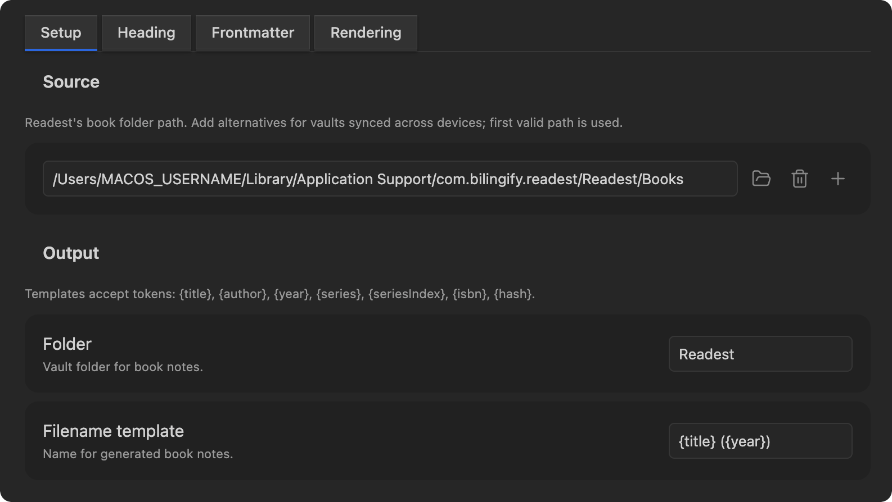

# Settings reference

The settings tab has four pages: Setup, Heading, Frontmatter, and Rendering. Click a page to open it; the back arrow returns to the overview. All settings are indexed by Obsidian's settings search.

On Obsidian 1.12.x the same settings render as one scrolling page with the four names as headings. Source paths reorder with up and down buttons instead of dragging, the output folder has no autocomplete, and settings are not indexed by settings search. Every setting below is present either way; the screenshots show the 1.13 layout.

## Templates

Several settings accept token-based templates. Available tokens:

| Token | Value |
|---|---|
| `{title}` | Book title |
| `{author}` | Author name |
| `{year}` | Publication year (`YYYY` extracted from metadata) |
| `{series}` | Series name |
| `{seriesIndex}` | Index within the series |
| `{isbn}` | ISBN |
| `{publisher}` | Publisher |
| `{language}` | Language |
| `{hash}` | Readest's internal book hash |

Empty tokens collapse cleanly: surrounding whitespace, separators (`-`, `_`), a trailing `by`, and empty parentheses/brackets are trimmed.

## Setup



### Source

One or more paths to Readest's Books folder. The plugin tries each in order and uses the first one that contains `library.json`. If none of your listed paths match (or if the list is empty), the platform default is tried as a fallback. When the fallback succeeds and you had at least one explicit entry, the discovered path is appended to your list so the next sync skips the lookup. Useful for vaults synced across devices where the same Readest data lives at different absolute paths.

Default location per platform:

| Platform | Default location |
|---|---|
| macOS | `~/Library/Application Support/com.bilingify.readest/Readest/Books` |
| Windows | `%APPDATA%\com.bilingify.readest\Readest\Books` |
| Linux | `$XDG_DATA_HOME/com.bilingify.readest/Readest/Books` (or `~/.local/share/...`) |

The `+` button in the Source header adds a path row; the `X` on a row removes it, and the drag handle reorders rows (order matters, since the first path that resolves wins). The folder icon opens a directory picker, or type the path manually.

### Output

#### Folder

Vault folder where book notes live. Defaults to `Readest`. Existing vault folders are suggested as you type. If cleared, falls back to the default. The path is kept vault-relative: leading slashes and `.`/`..` segments are stripped (so it can't escape the vault), and you're notified if the value was adjusted. If the path resolves to an existing file (not a folder), sync fails with a clear error.

#### Filename template

Token-aware. Default `{title} ({year})`. The result is sanitized (Windows-reserved characters stripped) and capped at 200 characters to stay under common filesystem limits.

If two books produce the same filename, the second is written to `<filename> (<hash8>).md` instead of overwriting the first.

### Auto-sync

#### Sync on startup

When on, a full sync of all books runs when Obsidian starts. Off by default.

#### Sync interval

Re-sync all books every N minutes while Obsidian is open. `0` (default) disables the interval.

Auto-sync runs are quiet: no progress notice, and the summary notice only appears when a note was created or updated, or a book failed. A persistent failure (e.g. an unreachable books folder) is reported once, not on every run; it is announced again if the error changes or after a run succeeds. A manual sync always reports.

On startup, auto-sync waits for Obsidian's metadata index to finish so renamed notes are re-found by their `readest-hash` instead of duplicated. Unchanged notes are not rewritten, so background runs don't touch files (or trip file-sync tools) unless something actually changed.

## Heading

### Heading level

`H1`-`H4`, or `None`. Applies to both the sync flow and the append flow. `None` removes the heading entirely; in that mode "Preserve manual edits" is force-disabled (sync rewrites the whole body).

### Sync heading

Token-aware heading text shown above the highlights section in notes created or updated by sync. Default `Highlights`.

### Append heading

Token-aware heading text used by the "Append one book to current note..." command. Default `{title} by {author}`.

### Preserve manual edits

When on (default), re-sync rewrites only the section under the sync heading. Frontmatter and any other content outside that section are preserved across syncs. When off, sync rewrites the entire file including frontmatter.

Force-disabled when Heading level is `None`.

## Frontmatter

Optional YAML block at the top of book notes.

### Include frontmatter

Master toggle. When off, all frontmatter options below are hidden.

### Tags

Comma-separated list of tags. Each is quoted in YAML, so values with `:` or `,` do not break the block. Leave blank to omit the property.

### Author

Off, plain text, or wiki-link. The wiki-link form renders as `author: "[[Author Name]]"` for backlink navigation in Obsidian.

### Series, Publisher

Off, plain text, or wiki-link - the same dropdown as Author. Series defaults to plain text, Publisher to off.

### Year, ISBN, Language

Single toggles. Each adds the corresponding field to frontmatter when its value is present in the book's metadata. Year and ISBN are on by default; Language is off. If a book declares several languages, they are joined with commas into one value.

### Genre

Master toggle for the genre field. Genres come from the book's metadata as exposed by Readest. The field is free-form and varies by source, so the four sub-options below normalize the more structured forms.

#### Format

`Plain` or `Wiki-link`. Same idea as Author. Defaults to `Plain`.

Wiki-links for genres fragment more easily than for authors because the underlying values can shift when you toggle the sub-options below. Opt in to wiki-link once your other genre settings are stable.

#### Max genres

Cap on how many genre values to keep, in source order. `0` (default) means unlimited.

#### Natural order

Swap inverted cataloging headings to natural reading order. Example:

```
Knowledge, Theory of  ->  Theory of Knowledge
Philosophy, Ancient   ->  Ancient Philosophy
State, The            ->  The State
```

Off by default. Applies to the single-comma form; multi-comma cases pass through unchanged. Composes with Clean names: if both are on, decorators like ` -- Early works to 1800` are stripped first, then the remainder is un-inverted.

#### Clean names

Strip cataloging suffixes (` -- subqualifier` and trailing `(parenthetical)`), then de-duplicate. Example:

```
Ethics -- Early works to 1800  ->  Ethics
Temperance (Virtue)            ->  Temperance
```

On by default.

### Readest hash

Adds `readest-hash: <hex>` to frontmatter. **Strongly recommended to leave on.** The plugin uses this field to find a renamed note on re-sync; without it, matching falls back to the filename template alone, and renaming a note in Obsidian will orphan the old sync target.

If two notes accidentally share the same `readest-hash` (e.g. you duplicated a note in the file explorer with its frontmatter intact), the plugin surfaces a Notice on the next sync, with details in the developer console.

### Extra fields

Free-form YAML appended inside the frontmatter block. [Tokens](#templates) are substituted, so `rating: ""` or `readest-id: "{hash}"` resolve against the book. Lines containing only `---` are stripped so a stray fence cannot break the block. Otherwise the content is spliced in as-is, so invalid YAML will break the frontmatter; you own the contents (if a substituted value could contain a colon or quote, wrap the field value in quotes).

## Rendering

### Highlights

#### Filter

Which annotations to include:

- All annotations
- Only highlights (counts `highlight` and `squiggly` styles)
- Only underlines
- Only with notes

#### Style

How each highlight is rendered in markdown:

- **Blockquote** (`> text`)
- **Plain text**
- **Callout** (`> [!quote]` block)
- **Bullet** (`- text`)

#### Sort order

Order of highlights within a book note:

- **Book position** (default): by page, ties broken by creation time
- **Highlight date**: by when you made the highlight, ties broken by page

With the "Group under page headings" separator, highlights are still bucketed by page; the sort order then only affects ordering within each page.

#### Collapse line breaks

How line breaks within highlights are handled:

- **Off** (default): preserve line breaks in highlights that span multiple paragraphs
- **On**: replace line breaks with a space

#### Separator

How highlights are separated within a book note:

- **Horizontal rule** (`---` between highlights)
- **Blank line**
- **Group under page headings** (`### Page N` between groups, no separator between highlights on the same page)
- **Group under chapter headings** (`### <chapter title>` between groups, matching Readest's own export)
- **None** (one per line, no separation)

Chapter titles come from a table-of-contents cache Readest writes the first time a book is opened. If a book shows no chapter headings, open it once in Readest and re-sync. Highlights the cache cannot place (or books without a cache) render without headings.

#### Show count

When on, a `Total highlights: N` line is rendered under the highlights heading. Counts the annotations actually included (respects the Filter setting). Off by default.

#### Block IDs

Off by default. When on, each highlight gets a stable Obsidian block ID (`^rdst-<hash>`) on its own line, letting you link to a specific highlight from anywhere - another note, a daily note, or a canvas card - with `[[Book note#^rdst-abc123]]`. The ID is derived from the highlight's Readest location, so it stays the same across re-syncs and existing links keep working.

The ID line is hidden in reading view but visible in source and live-preview mode, which is why this is off by default. If Readest re-anchors a highlight (its location changes), that highlight's ID changes and links to the old ID break.

#### Readest link

Off by default. Adds an `Open in Readest` link under each highlight that opens the annotation in Readest at its exact location. Two forms:

- **Web link** (`https://web.readest.com/o/book/{hash}/annotation/{id}`): a universal link. On mobile it opens the Readest app; on desktop it resolves to Readest's web landing page. More robust - no OS handler registration needed.
- **App link** (`readest://book/{hash}/annotation/{id}`): the custom scheme. Only works if the Readest desktop/mobile app has registered the `readest://` handler with the OS.

Both mirror the link formats Readest itself uses for markdown export. The web form is the safer default.

### Metadata

Per-highlight metadata (page, color).

#### Page number, Color

Each is an independent toggle. The page number is omitted when the Separator is "Group under page headings", since the heading already carries it; under chapter headings it still renders.

#### Render underlines

When on, underlined annotations are wrapped in `<u>...</u>` so they render with an underline in preview.

#### Placement

`Below highlight` or `Inline with highlight`. Inline appends `*(metadata)*` to the last line of the highlight; Below puts it on its own italic line.

### Notes

#### Show notes

Toggle for including notes at all.

#### Placement

- **Attached** (inside the highlight block, prefixed `**Note:**`)
- **Separated** (below the highlight, plain `**Note:**`)
- **Callout** (`> [!note]` block below the highlight)
